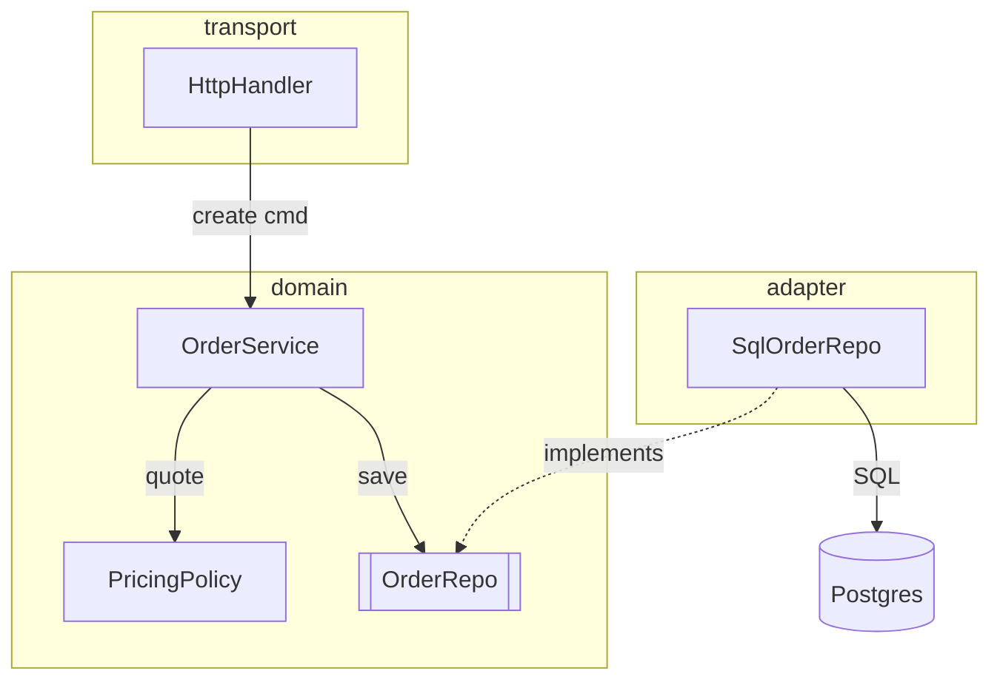

# Diagram Patterns

Starting templates, one per intent. Replace the identifiers with the real ones from the code. Keep the edge labels; they are the part that carries the information.

Two things to settle before picking a template:

1. **Write the caption first**, then build the diagram to satisfy it. If the caption needs more than one sentence, the diagram is making more than one claim and wants splitting.
2. **Fix the level of abstraction.** One diagram shows classes, or deployable units, or business areas — never a mix. Mixed abstraction is the most common reason a generated diagram cannot be read.

## Component and dependency map (ASCII)

```text
┌─ transport ────────────────────────────────────────┐
│  HttpHandler ──decode──▶ CreateOrderCmd            │
└───────┬────────────────────────────────────────────┘
        │ calls
┌───────▼─ domain ───────────────────────────────────┐
│  OrderService ──quote──▶ PricingPolicy             │
│       │                                            │
│       └──saves via──▶ [[OrderRepo]] (port)         │
└────────────────────────────▲───────────────────────┘
                             │ implements
┌─ adapter ───────────────────┴──────────────────────┐
│  SqlOrderRepo ──SQL──▶ (Postgres)                  │
└────────────────────────────────────────────────────┘
```

The separation claim is checkable from the picture: every edge crossing a boundary points toward `domain`, and `domain` names no adapter. Say so in one sentence and stop.

Notation worth keeping consistent: `[[Name]]` for an interface or port, `(Name)` for an external system, a bare name for a concrete type.

## Component and dependency map (Mermaid)

Use this once the ASCII crowds, on a surface that is confirmed to render Mermaid.

````text

````

## Sequence (ASCII)

```text
Client        HttpHandler      OrderService       OrderRepo
  │                │                │                 │
  ├─ POST /order ─▶│                │                 │
  │                ├─ create(cmd) ─▶│                 │
  │                │                ├─ save(order) ──▶│
  │                │                │◀─ id ───────────┤
  │                │◀─ OrderId ─────┤                 │
  │◀─ 201 Created ─┤                │                 │
```

One lifeline per actor. Mark anything asynchronous with a dashed arrow and say what resumes it, so the reader does not read a queue as a blocking call.

## Layered block with named boundaries

```text
╔═ browser ══════════════════════════════════════════╗
║  UI ──fetch /api──▶                                ║
╚══════════════════════╪═════════════════════════════╝
                       │ HTTPS, session cookie   ◀── trust boundary
╔═ api process ════════▼═════════════════════════════╗
║  Router ──▶ Service ──▶ Repository                 ║
╚══════════════════════╪═════════════════════════════╝
                       │ TCP, service account
╔═ managed database ═══▼═════════════════════════════╗
║  Postgres                                          ║
╚════════════════════════════════════════════════════╝
```

Label the crossing, not just the box: what protocol, and whose credential.

## State machine

```text
        submit           approve
 draft ────────▶ pending ─────────▶ approved
   ▲               │
   │               │ reject
   │               ▼
   └──reopen──── rejected
```

Every transition carries its event. An unlabeled arrow between states is an unanswered question.

## Data-flow pipeline

```text
raw CSV ──parse──▶ Row[] ──validate──┬──ok──▶ Valid[] ──enrich──▶ Enriched[] ──write──▶ orders
 (bytes)           (dict)            │
                                     └─fail─▶ Error[] ─────write───────────────────────▶ dead_letter
```

Name the shape of the value at each hop. The reader is usually trying to find where the shape changes.

## Tree decomposition

```text
Config
├── server                     required
│   ├── port      int          default 8080
│   └── tls?      block        optional, required in prod
├── database                   required
│   └── url       string       secret, never logged
└── features?     map<str,bool> optional
```

Mark optionality with `?` and keep the constraint in a third column instead of a paragraph below.

## Mermaid traps

These bite on real renderers and are cheap to avoid.

- **Reserved words are not node ids.** `end`, `subgraph`, and `graph` break a flowchart. `end` in particular fails silently or mangles the layout.
- **Quote any label containing punctuation**: `A["Process (main)"]`, `-->|"O(1) lookup"|`. Unquoted parentheses and brackets are the most frequent parse failure.
- **No `\n` escapes, no HTML tags, and no emoji in labels.** Use an actual line break where a break is unavoidable.
- **Node ids in camelCase, no spaces.** Underscores can disturb edge routing in some processors.
- **Prefer `flowchart` with `subgraph` over Mermaid's `C4` type.** Mermaid's own docs mark `C4` experimental, and it has no legend, no line-style control, and no layout direction — layout follows statement order.
- **`erDiagram` is also marked experimental.** It is still the right choice for a data model; just expect syntax churn between versions.
- **`Note over` on a sequence diagram may be stripped** by some renderers. Do not put load-bearing information in one.
- **There is a character-count guard, not a node-count guard.** Mermaid enforces `maxTextSize` and fails with "Maximum text size exceeded". The fix is splitting the diagram, not raising the limit.

## Chapter skeleton

The caption carries the claim; the outline appears only when the explanation is long enough to need navigating.

```markdown
## Overview

<one diagram>

**Figure 1 — order creation, from HTTP request to stored row.** `OrderService` owns the
decision, `SqlOrderRepo` owns the storage, and nothing in the domain names an adapter.

## Chapters

1. `HttpHandler` — where the request becomes a command
2. `OrderService` — the decision and the invariants it protects
3. `OrderRepo` and `SqlOrderRepo` — the port and its single implementation

## 1. `HttpHandler`

The `transport` box in figure 1. Decodes and validates only; it holds no pricing rule
([http/handler.go:42](http/handler.go:42)). Fragile because the DTO and the command
have drifted apart twice.
```
