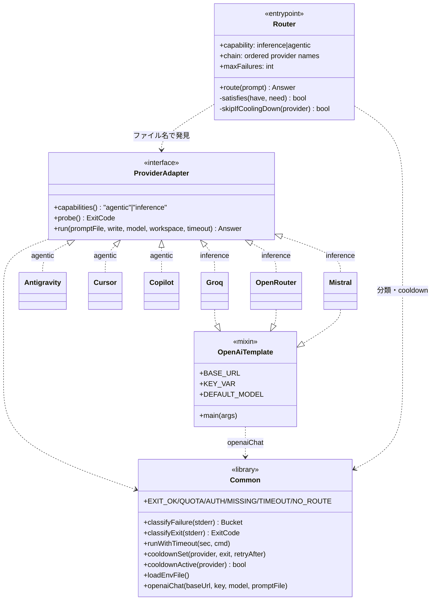
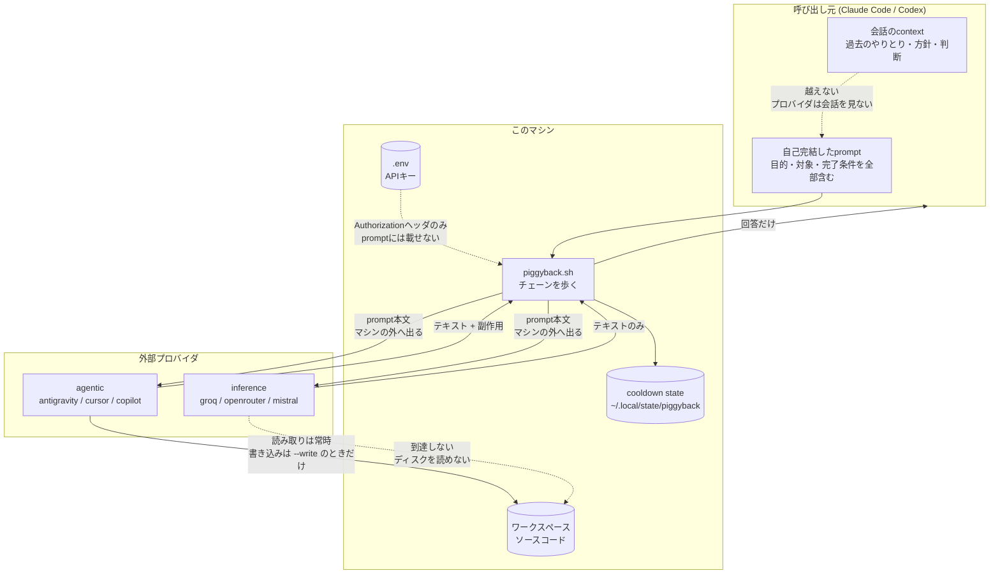
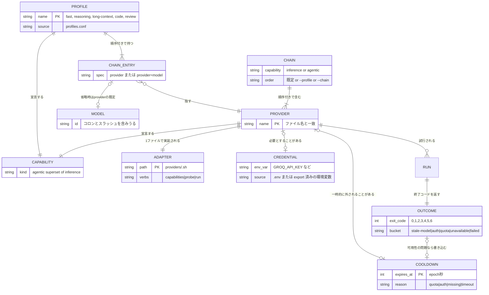
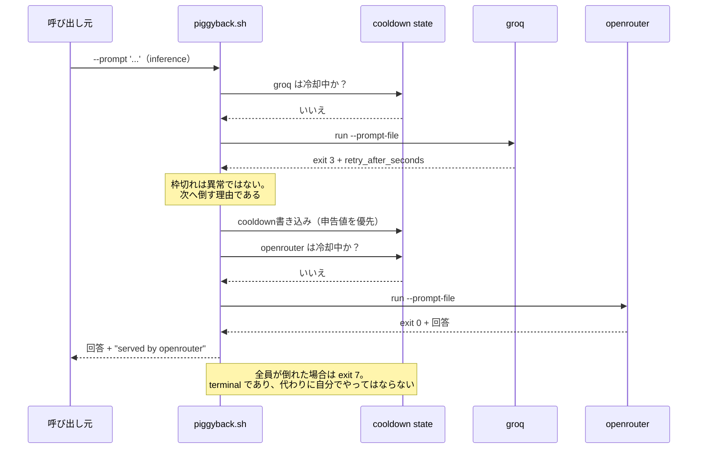
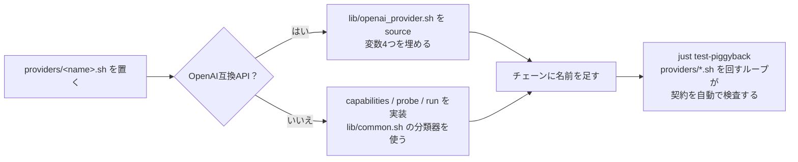

# piggyback — 構造と越境

契約は [SKILL.md](SKILL.md) / [SKILL-ja.md](SKILL-ja.md) にある。ここは**何がどの境界を越えるか**を図で押さえるための補足。

境界は3つある。取り違えると事故になるのはこの3つだけで、他は実装の詳細である。

1. **contextの境界** — 呼び出し元の会話は、どのプロバイダにも渡らない
2. **マシンの境界** — promptは**このマシンから出る**。無料枠は入力を学習に使う権利を留保しているのが普通
3. **capabilityの境界** — ファイルに触れるのは `agentic` だけ。`inference` は物理的にディスクを読めない

## 全体構成

routerはプロバイダ名を一切ハードコードしない。知っているのはadapterの3verb契約と終了コード契約だけで、だから新しいプロバイダは `providers/` にファイルを1つ置けば増える。

`agentic` の3つはそれぞれ固有のCLIを叩くので個別実装。`inference` の3つはOpenAI互換なので、テンプレートに変数4つを渡すだけの薄いファイルになっている。

## 越境するもの、しないもの

一番効くのはこの図。**破線が越えてはいけない/越える境界**である。

読み取るべき点は3つ。

- **会話のcontextは越えない。** だからpromptは自己完結していなければならない。「さっき話したバグ」は向こうには存在しない
- **prompt本文はマシンの外に出る。** secret・認証情報・`.env` の中身を載せないのはこのため。keyそのものはAuthorizationヘッダに載るだけで、prompt本文には入らない
- **`inference` はファイルシステムに到達しない。** これは運用上の約束ではなく構造的な事実であり、だから編集タスクをinferenceに流すのが危険（「やっていない編集をやったと報告する」）であり、routerが手前で弾いている

## 状態モデル

cooldownと設定の関係。「なぜあるプロバイダが飛ばされたのか」はこの関係だけで説明できる。

`CHAIN_ENTRY` から `MODEL` が**省略可能**なのが要点の1つである。モデルを書かなければproviderの既定が使われる——CursorのFreeプランは名前付きモデルを全部拒否するので、そこではこれが唯一動く形になる。

`OUTCOME` から `COOLDOWN` が**条件付き**なのが要点である。タスク失敗（`1`）ではcooldownを書かない。そのプロバイダの可用性には問題が無く、書いてしまうと別の仕事から見えなくなる。

## 1リクエストの流れ

枠切れで倒れ、cooldownが書かれ、次が応える。

最後のノートが運用上いちばん重要である。`7` を受けた側が黙って自分の枠で実行し直すと、**このskillを経由した意味が消える**。自分の予算を使う価値があるかは呼び出し元が決める。

## プロバイダを1つ足すとき

触るのは1ファイルだけ。routerもテストも変更しなくてよい。

`probe` は**枠を消費してはならない**という制約だけ守れば、あとは終了コード契約に従うだけである。
